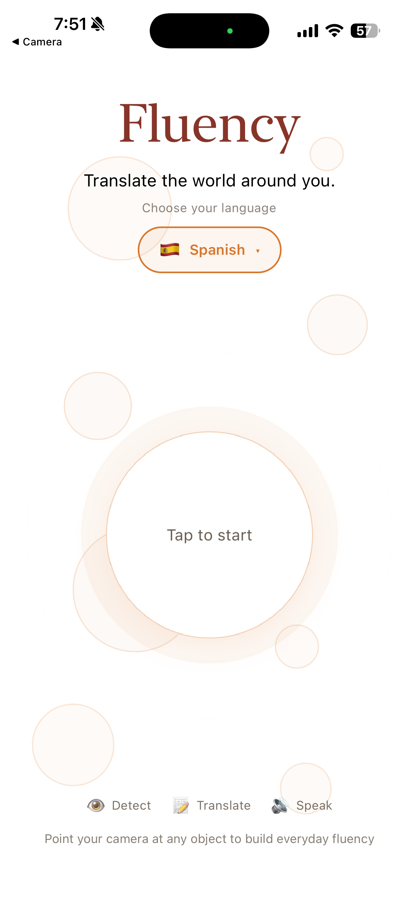
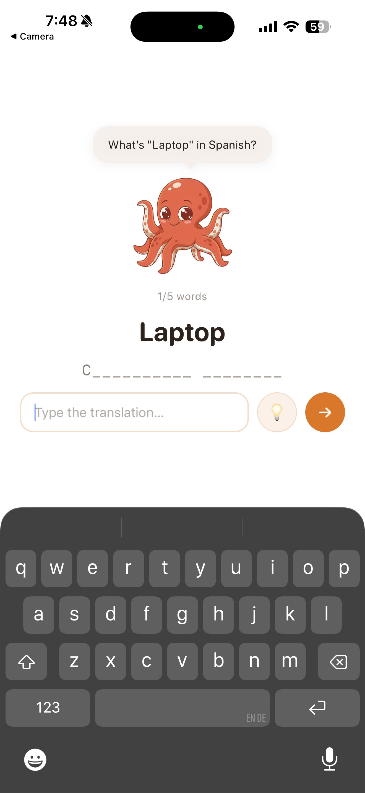
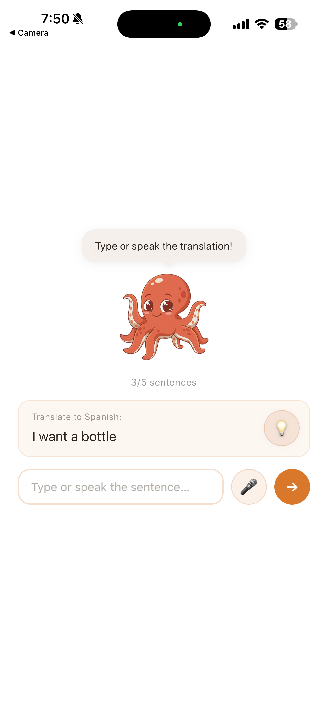
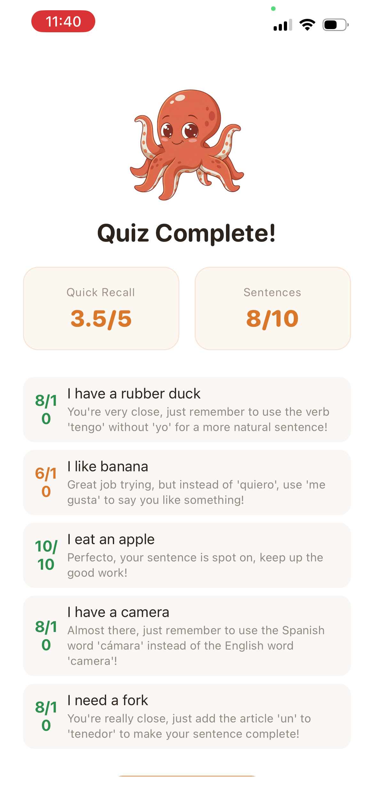
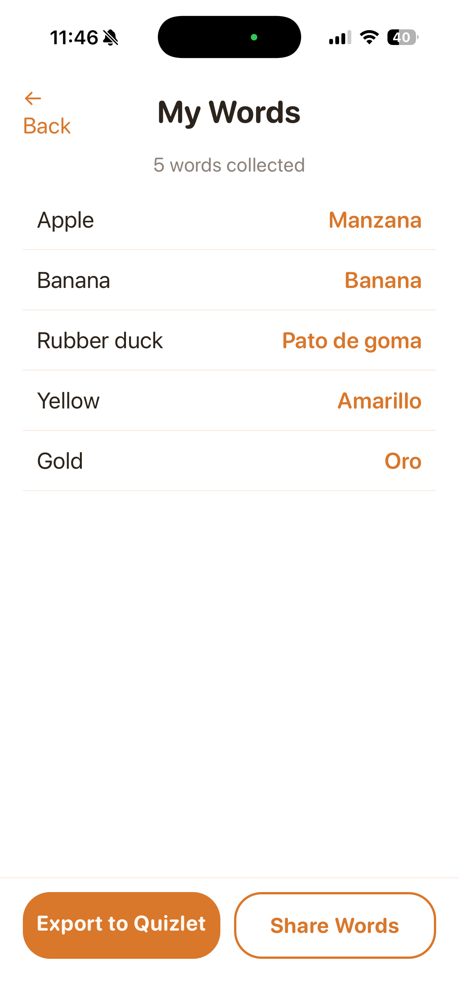
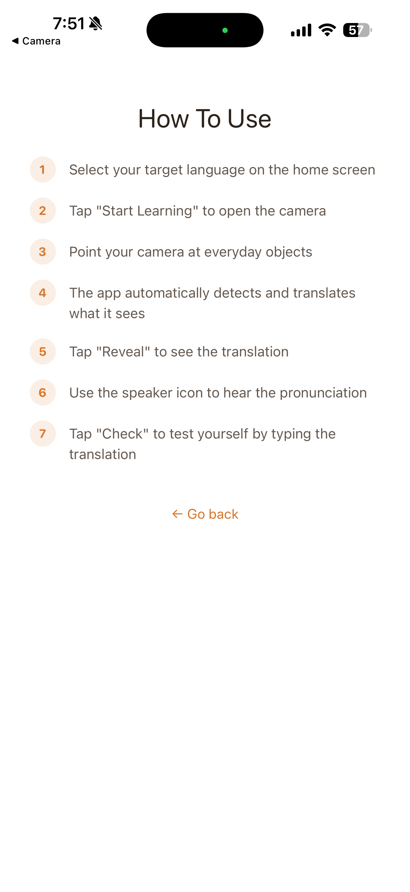

# Fluency

A camera-first language learning app built at **HooHacks 2026**. Instead of studying language in isolation, you live it. Point your phone at any object around you, and Fluency identifies it, translates it into your target language, lets you hear the pronunciation, and quizzes you, all in real time. It's the language teacher that follows you everywhere, turning your entire environment into an immersive classroom.

## How It Works

1. **Scan**: The camera auto-captures and identifies objects using Google Cloud Vision
2. **Learn**: See the translation, hear it spoken aloud, and practice saying it yourself
3. **Quiz**: After collecting words, run through a multi-phase quiz:
   - *Recall*:  Type translations from memory (fuzzy-matched)
   - *Sentences*: Write and speak AI-generated practice sentences
   - *Grading*: Get scored 1–10 with feedback on both written and spoken attempts

Supports **Spanish, French, Portuguese, Mandarin, Japanese, and Korean**.

## Demo

[](https://www.youtube.com/watch?v=T5vpNF_fCR0)

### Screenshots

<p align="center">
  
  
  
  
  
  
  
  
</p>

## Tech Stack

**Frontend**: React 19, React Native, Expo SDK 54, TypeScript, Expo Router

**Backend**: FastAPI (Python, async)

**AI / ML Services**
- Google Cloud Vision: object detection
- Google Cloud Translation: real-time translation
- Groq Llama 3.3 70B: sentence generation, grading, pronunciation feedback
- Groq Whisper (large-v3-turbo): speech-to-text transcription

## Architecture

```
wordapp/
├── app/                     # Screens (file-based routing via Expo Router)
│   ├── (tabs)/
│   │   ├── index.tsx        # Home — language picker + animated launch
│   │   └── camera.tsx       # Camera — auto-detect, translate, pronounce
│   ├── quiz.tsx             # Multi-phase quiz (recall → sentences → grading)
│   └── my-words.tsx         # Word collection + Quizlet export
├── backend/
│   └── main.py              # FastAPI — 4 endpoints (detect, generate, grade, transcribe)
├── contexts/
│   └── WordsContext.tsx      # Global state — collected words via React Context
├── services/
│   └── api.ts               # Typed API client
├── components/              # Shared UI (themed primitives, navigation)
├── constants/               # Theme (warm palette), config
└── assets/                  # Mascot art, sound effects, custom fonts
```

### Backend API

| Endpoint | What it does |
|---|---|
| `POST /detect` | Takes a base64 camera frame, returns detected object + translation |
| `POST /generate-sentences` | Generates practice sentences for a word list via Llama |
| `POST /grade-sentences` | Batch-grades written sentence attempts (1–10 + feedback) |
| `POST /transcribe-audio` | Transcribes speech via Whisper, grades pronunciation via Llama |

## Built With

- [Expo](https://expo.dev/) + [Expo Router](https://docs.expo.dev/router/introduction/)
- [FastAPI](https://fastapi.tiangolo.com/)
- [Google Cloud Vision](https://cloud.google.com/vision)
- [Google Cloud Translation](https://cloud.google.com/translate)
- [Groq](https://groq.com/)
